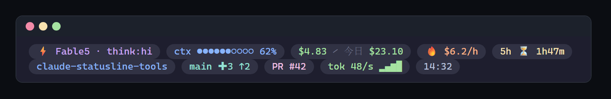

<div align="center">

# 💊 ccpill

**A pill-styled, blazing-fast statusline for Claude Code**

胶囊视觉 · Go 原生性能 · 本地 Web 配置中心 · 高度自定义

[](https://github.com/cass-2003/ccpill/releases/latest)
[](https://github.com/cass-2003/ccpill/actions/workflows/ci.yml)




</div>

> **状态：V0.2 已发布**（2026-07-15 立项；五平台预编译二进制见 [Releases](https://github.com/cass-2003/ccpill/releases)）

## ✨ 特性

- 💊 **胶囊视觉** —— Catppuccin 薄胶囊默认主题；胶囊背景可一键关闭，退化为彩色文字 + `│` 分隔的轻量模式
- ⚡ **快** —— Go 单二进制，渲染热路径 ~0.6ms；重数据全部惰性采集 + 独立缓存，任何数据源失败都不拖慢状态栏
- 🧩 **75 个 Segment** —— 会话 / 费用 / 限额 / Git 全家桶 / 系统 / OAuth 用量，全量对齐主流友商
- 🎛️ **Web 配置中心** —— `ccpill --config`：1-3 行拖拽布局、真实会话数据实时预览、所见即所得
- 🎨 **高度自定义** —— 每颗胶囊独立 RGB 前景 / 底色 / 前缀 / 加粗；自定义插槽把任何文本或命令输出放上状态栏
- 🔌 **一键上岗** —— `--install` 写入 settings.json（自动备份），`--uninstall` 干净卸载

## 🚀 快速上手

### 一键安装（推荐）

```bash
# 任选其一：npm 用户
npx @cassandra0032/ccpill --install
```

```powershell
# Windows（PowerShell）
irm https://raw.githubusercontent.com/cass-2003/ccpill/main/scripts/install.ps1 | iex
```

```bash
# macOS / Linux / Git Bash
curl -fsSL https://raw.githubusercontent.com/cass-2003/ccpill/main/scripts/install.sh | bash
```

脚本自动完成三步：Releases 预编译二进制（暂无时用本机 Go `go install` 源码直装，二选一）→ 落到 `~/.claude/ccpill/bin/` → 写入 Claude Code `settings.json`（自动备份原配置）。重启 Claude Code（或开新会话）即生效。

### 手动安装

```bash
go install github.com/cass-2003/ccpill@latest   # 或 clone 后 go build -o ccpill.exe .
ccpill --install    # 一键上岗——写入 settings.json（自动备份）
```

效果（默认双行布局）：

```
 ⚡ Fable 5 · think:hi  ctx ●●●●●●○○○○ 62%  $4.83  今日 $471.75  🔥 $186.9/h  5h 34% ⏳ 2h17m
 📁 ccpill  ⎇ main ✚15 未提交堆积  ⏱ 2h13m  05:10
```

### 常用命令

| 命令 | 作用 |
|------|------|
| `ccpill --install` | 一键上岗：写入 `~/.claude/settings.json` 的 `statusLine`（时间戳备份 + 原子写） |
| `ccpill --config` | 打开本地 Web 配置中心：主题/图标集/胶囊开关/1-3 行拖拽布局，**真实会话数据实时预览** |
| `ccpill --uninstall` | 卸载：移除 `statusLine` 配置（同样先备份） |
| `ccpill --import-ccstatusline [path]` | **从 ccstatusline 一键迁移**：布局逐行映射、custom text/command 转插槽、hex 色与加粗转 overrides；不支持项列明原因不中断 |
| `ccpill --version` | 版本号 |

无参数时从 stdin 读 Claude Code 状态 JSON、向 stdout 输出 ANSI 状态栏——这是 Claude Code 的调用方式，一般不用手动执行。

## 🧩 Segment 总览（75 个）

四大类，全部在 Web 配置中心拖拽启停。点开分类查看完整清单：

<details>
<summary><b>核心件（28 个）</b> —— 模型 / 上下文 / 费用 / 限额 / Git / 系统 / 自定义</summary>

| ID | 显示 | 数据源 |
|----|------|--------|
| `model` | 模型名 + 思考等级（`think:hi`） | stdin |
| `context` | 上下文用量条 + 百分比（80% 变色 / 90% 红警「即将压缩」） | stdin 优先，transcript 兜底 |
| `cost` | 本会话花费 | stdin `cost.total_cost_usd` |
| `today` | 今日总花费（跨会话），超 `daily_budget` 红警 | transcript 扫描 + 内嵌定价表重算 |
| `burn` | 当前 5h block 的烧钱速率 $/h | 同上 |
| `block` | 5h 限额窗口：已用 % + 剩余时间（≥90% 红警） | stdin `rate_limits` 优先，transcript 推断兜底 |
| `git` | 分支 + 脏文件数 + ahead/behind（脏文件 ≥`git_dirty_warn` 红警） | `git status --porcelain=v2`（500ms 超时） |
| `dir` | 当前目录名 | stdin |
| `worktree` | worktree 名称（在 worktree 中才显示） | stdin |
| `speed` | 最近 5 分钟输出 token 速度 + 趋势迷你柱（`tok 48/s ▂▄▆█`） | transcript |
| `session` | 会话时长 | stdin `total_duration_ms` |
| `compact` | 本会话 compaction 次数 | transcript `compact_boundary` |
| `style` | 输出风格 + vim 模式 | stdin |
| `clock` | 时钟 HH:MM | 本机 |
| `cpumem` | CPU% / 内存%（≥90% 红警） | Win32 API（无子进程） |
| `mcp` | MCP server 数量 | `~/.claude.json`（5min 缓存） |
| `pr` | 当前分支关联 PR 号 | `gh` CLI（2s 超时，5min 缓存） |
| `api` | Anthropic API 状态 | status.anthropic.com（5min 缓存） |
| `tokens` | 会话输入/输出 token 总量（`⇅ 1.2M/38k`） | stdin 优先，transcript 兜底 |
| `cachehit` | prompt cache 命中率（越高越省钱） | transcript |
| `lines` | 本会话代码行增删（`+123 −45`） | stdin `cost.total_lines_*` |
| `weekly` | 7 天限额窗口：已用 % + 重置倒计时（≥90% 红警） | stdin `rate_limits.seven_day` |
| `version` | Claude Code 版本号 | stdin |
| `gitsha` | HEAD 短 SHA | 复用 git 单次采集（零额外子进程） |
| `sessionid` | 会话 ID 前 8 位 | stdin |
| `email` | 登录账号邮箱 | `~/.claude.json`（5min 缓存） |
| `text` | 自定义静态文本 | config `custom_text` |
| `cmd` | 自定义命令输出首行（1s 超时，10s 缓存） | config `custom_command` |

</details>

<details>
<summary><b>Git 全家桶（14 个）</b> —— 对齐 ccstatusline 28 个 git widget + claude-powerline 独有项</summary>

| ID | 显示 | 说明 |
|----|------|------|
| `gitstatus` | `S2 U1 ?3 ✖1` / 干净时 `✓` | 工作区总览：S 暂存(绿) U 未暂存(橙) ? 未跟踪(灰) ✖ 冲突(红) |
| `gitstaged` / `gitunstaged` / `gituntracked` | `S:2` / `U:1` / `?:3` | 单项文件计数，为零隐藏 |
| `gitconflicts` | `✖1`（红警） | 合并冲突文件数 |
| `gitstash` | `⚑2` | stash 条数（porcelain `--show-stash`，零额外子进程） |
| `gitstate` | `REBASE`（红警） | 进行中的 rebase/merge/cherry-pick/bisect/revert（纯文件系统探测） |
| `gitdiff` | `+42 −10`（+绿 −红） | 相对 HEAD 的未提交增删行数（`diff --shortstat`，惰性） |
| `gitins` / `gitdel` | `+42` / `−10` | 增删行拆分件 |
| `gittag` | `v0.2.0` | 最近 tag（`describe --tags --abbrev=0`，惰性） |
| `gitage` | `commit 3h` | 距上次 commit 时长（`log -1 --format=%ct`，惰性） |
| `gitrepo` | `my-repo` | 仓库根目录名（walk-up 找 `.git`，支持 worktree 重定向，零子进程） |
| `gitremote` | `owner/repo` | origin 远程解析（https/ssh 两种 URL 格式） |

> 轻数据（staged/unstaged/untracked/conflicts/stash/upstream）全部来自原有 porcelain v2 **单次采集顺手解析**，零额外开销；
> 重数据（diff 行数/tag/age/remote）各自惰性——不拖进布局就一个子进程都不跑。

</details>

<details>
<summary><b>全品类对齐件（14 个）</b> —— 会话元信息 / token 速率 / 系统 / OAuth 用量</summary>

| ID | 显示 | 数据源 |
|----|------|--------|
| `sessionname` | `修复登录超时` | `/rename` 写入 transcript 的 custom-title |
| `msgcount` | `msg 23` | 本会话用户消息数（排除 tool_result 回写） |
| `resptime` | `resp 48s` | 提问→首个回复的平均耗时（transcript 时间戳配对） |
| `tokwrite` | `cachew 1.8M` | 会话缓存写 token（cache-read 的姊妹件） |
| `speedin` / `speedtotal` | `in 12/s` / `tok∑ 8.2k/s` | 最近 5 分钟输入/全量 token 速度 |
| `ctxwin` | `win 1.0M` | stdin `context_window_size` |
| `ctxusable` | `ctx可用 65%` | 自动压缩阈值（80% 可用区）内的占用，≥90% 红警 |
| `memfree` | `free 12.4G/32G` | Win32 GlobalMemoryStatusEx（零子进程） |
| `termwidth` | `term 213` | CONOUT$ 控制台缓冲区（stdout 是管道时照常可用） |
| `cachetimer` | `cache ⏳ 3m40s` | prompt cache TTL 倒计时，自动识别 5m/1h 档，过期隐藏 |
| `weeklysonnet` / `weeklyopus` | `7d Sonnet 8%` | **OAuth 用量接口**分模型周限额（stdin 没有的数据） |
| `overage` | `超额 $106/$3894` | OAuth 用量接口超额（overage）已用/月上限 |

> OAuth 用量接口与 ccstatusline / CCometixLine 同源（`/api/oauth/usage`，凭据读 Claude Code 自己的
> `.credentials.json`，只读不回显）；5 分钟缓存，失败静默隐藏，绝不拖慢渲染。
>
> **未对齐项及原因**：Jujutsu 8 件（jj 用户群极小，本机无 jj 无法验证，有需求再加）；
> voice/remote-control 状态（数据源为 ccstatusline 私有 hook 生态）；separator/flex-separator/link/custom-symbol
> （胶囊设计自带分隔与自定义文本，OSC8 链接终端支持参差）。

</details>

<details>
<summary><b>细粒度拆分件（19 个）</b> —— 合并型胶囊的单项版本，自由组合排布</summary>

对齐 ccstatusline 的 widget 粒度：

| 母件 | 拆分件 |
|------|--------|
| `model` | `modelname`（仅模型名）· `think`（仅思考等级） |
| `context` | `ctxbar`（仅进度条）· `ctxpie`（饼形 `◕ 62%`，设计稿单行紧凑形态）· `ctxpct`（仅百分比）· `ctxlen`（上下文 token 数） |
| `tokens` | `tokin` · `tokout` · `tokcache`（缓存读）· `toktotal`（全部合计） |
| `git` | `gitbranch`（仅分支）· `gitchanges`（仅脏文件数）· `gitab`（相对远程 `+领先`绿/`−落后`红） |
| `block` | `blockpct`（仅已用%）· `blocktime`（仅倒计时） |
| `cpumem` | `cpu` · `mem` |
| `style` | `outstyle`（仅风格名）· `vim`（仅 vim 模式） |

> 费用类 segment 采用 **auto 模式**：transcript 自带 `costUSD` 直接用（老版本 Claude Code）；
> 新版不写该字段，按 `message.model` 查内嵌定价表重算（含 5m/1h 缓存写价与缓存读价）。

</details>

## ⚙️ 配置

配置文件：`~/.claude/ccpill/config.toml`（`CLAUDE_CONFIG_DIR` 优先）。推荐用 `ccpill --config` 可视化编辑，手改示例：

```toml
version = 1
theme = "catppuccin-mocha"   # 或 tokyo-night / nord / dracula / gruvbox-dark
pills = true                  # false = 无胶囊背景，彩色文字 + │ 分隔
icon_set = "nerd"             # nerd / unicode / ascii
caps = "auto"                 # auto / round / flat —— 胶囊圆角端帽，与图标集独立
                              # round 需字体含 Powerline 半圆字形（Nerd Font 或 Cascadia Mono）
minimal = false               # 紧凑模式：去掉文字前缀（think:/ctx/tok/今日/5h…），只留数值与图标
daily_budget = 0.0            # >0 时启用今日预算红警
git_dirty_warn = 15           # 脏文件数红警阈值
custom_text = ""              # text segment 显示的静态文本
custom_command = ""           # cmd segment 执行的命令（输出首行，1s 超时）

lines = [
  ["model", "context", "cost", "today", "burn", "block"],
  ["dir", "git", "speed", "session", "clock", "slot:ip"],
]

# 逐 segment 外观覆盖：前景色 / 底色 / 前缀 / 加粗（预警反色时不生效，保证红警可读）
# Web 配置中心里点任意胶囊的色点即可可视化编辑
[overrides.model]
color = "#ff8800" # 前景色
bg = "#11111b"    # 单颗胶囊底色（与主题统一底色不同）
label = "M "      # 前缀替换：删掉此行=默认前缀，空串=去前缀（比全局 minimal 更细），其他=自定义文字
bold = true

# 自定义插槽：想加几个加几个，布局里用 "slot:<name>" 引用
[[slots]]
name = "ip"
command = "curl -s ifconfig.me"  # 与 text 二选一，都填时 text 优先
color = "#89b4fa"                # 空 = 主题 Extra 色

[[slots]]
name = "备注"
text = "搬砖中"
color = "#f5c2e7"
```

- `lines` 支持 1-3 行，每行填 segment ID，未知 ID 自动忽略（向前兼容）
- Web 配置中心与终端渲染共用同一 compose 层，**所见即所得**

## 🏎️ 性能

| 路径 | 耗时 |
|------|------|
| 渲染热路径 | **~0.6ms**（sample 输入 hyperfine 实测均值 620µs） |
| transcript 全量扫描（1.6GB） | 冷 ~5s → 结果缓存 60s，热路径 ~40ms |
| git / PR / MCP / API | 各自独立 TTL 缓存，尽力而为——任何数据源失败不影响其余 segment |

## 📚 文档

- **使用指南（推荐先读）**：[`docs/USAGE.md`](docs/USAGE.md) —— 布局拖拽、色点外观面板、自定义插槽实例、FAQ
- 产品需求：`docs/PRD.md`
- 竞品拆解笔记：`docs/research/`（ccstatusline / CCometixLine / ccusage 源码级拆解）

## 🛠️ 开发

```bash
go build -o ccpill.exe .
go vet ./... && go test ./...
./ccpill.exe < testdata/sample.json   # 本地预览
```

## 📄 License

[MIT](LICENSE)
